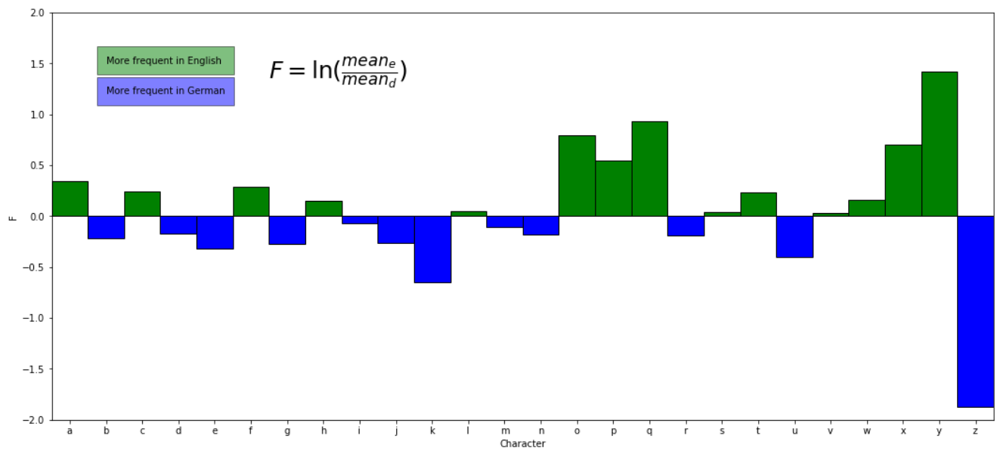

# Natural Language Processing

This repository contains three Jupiter notebooks solving three tasks
to the topic natural language processing. These notebooks have been 
developed as part of a course at Fachhochschule Nordwestschweiz FHNW in Brugg, 
Switzerland. All required steps to reproduce the results are documented and all training and 
test data is available in this repository via git lfs.

## Language detector

Creates a decision tree to detect languages based on the relative frequency of letters. 
Calculates the probability for the languages english and german. The decision tree is 
allowed a maximum depth of 4 and a maximum amount of 10 leafs. The decision is 
therefore made by analysing only 4 letters in the text (o, e, a, t), which have the 
lowest overlap between the occurrence probability.

## Gender classifier

The training data is cleansed by removing stopwords, special characters,
most common words and are stemmed with porter stemming algorithm. The classifier 
"Multinomial Naïve Bayes" is used to classify gender (2 categories) and
 Linear SVC (Support Vector Classifier) is used for age classification (3 categories).  

## Part of Speech Tagger

A POS-Tagger for german language achieving an accuracy of 97.5% on the test set.
The training data contains 12 classes (part of speech). The Keras library is 
used to build and train a model.